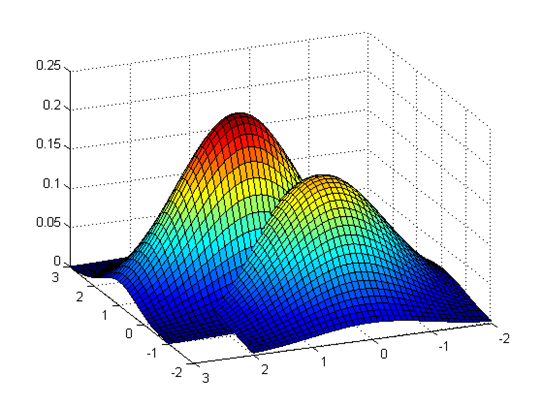

# Bayes-Classifier-from-scratch
Lo scopo di questo progetto è quello di comprendere con la pratica la teoria alla base dei classificatori Bayesiani.

## Il problema: ##
Si dispone di un dataset composto da un insieme di elementi *X*.

Ad ogni pattern **Xi** è associata un'etichetta **Yi** che ne indica la classe di appartenenza.

Il classificatore deve, dato in input un pattern **Xi** mai visto in precedenza, restituire la corretta etichetta **Yi** (tra tutte quelle possibili) facendo quindi un'operazione di **classificazione**.

## Elementi teorici ##

Per calcolare la giusta classe di appartenenza di un pattern Xi, si calcolano delle probabilità che dato in input un pattern Xi esso appartenga a una classe Wi (si fa per tutte le possibili classi, dopo di che si sceglie la classe con la probabilità più alta) tramite il **Teorema di Bayes**:

  - ***P(wi)***: Ovvero la **Probabilità a Priori** che un pattern qualsiasi scelto arbitrariamente appartenga alla classe Wi. Si calcola facilmente conteggiando gli elementi di una classe rispetto agli elementi totali. 
  
    (Ad esempio: il dataset ha 100 elementi totali, di cui 20 di una classe A. Allora la probabilità a priori di scegliere arbitrariamente dal dataset un elemento appartenente alla classe A è **P(A) = 20/100 = 0.2**)

 - ***P(X|wi)***: Ovvero la **Probabilità Condizionata** che scelto un pattern di una classe Wi, esso sia proprio X. Questa probabilità non è nota a priori. Per stimarla occorre fare un'addestramento di un modello mediante i dati del training set.
 
  - ***P(X)***: Ovvero la **Probabilità Assoluta** di classificare un determinato pattern X. Il suo valore tiene conto di tutti i possibili eventi che portano ad avere un pattern X come pattern scelto (fungendo quindi da costante di normalizzazione essendo al denominatore).
   
    Per avere X come pattern scelto devono concatenarsi 2 eventi: deve essere scelto un pattern di una classe Wi (evento che si può verificare con probabilità **P(Wi)** ) e dato un pattern generico della classe Wi deve essere proprio X (evento condizionato con probabilità **P(X|Wi)** ). La concatenazione di eventi corrisponde al prodotto delle probabilità.
    Siccome un pattern X può idealmente appartenere a tutte le possibili classi, si ha una sequenza di possibili eventi disgiunti. Quindi si somma su tutte le classi ottenendo la seguente formula:
    
    

    
    

 
  - ***P(wi|X)***: Ovvero la **Probabilità a Posteriori** che dato un pattern X, esso appartenga alla classe wi. Questa è la probabilità che il sistema deve calcolare, per tutte le possibili classi. 
  
    La classe che ritorna la P(wi|X) più alta per un singolo pattern X sarà la classe associata a X.

## Stima delle Probabilità Condizionate ##

Come detto nella precedente sottosezione, le probabilità condizionate non si conoscono. Per stimarle si parte dall'ipotesi che elementi appartenenti a una stessa classe siano in qualche modo simili, e che quindi esistano delle distribuzioni gaussiane di probabilità che legano la posizione di un pattern X = [ x1,x2, ... xn]  in uno spazio N-dimensionale a un valore di probabilità che quel pattern sia proprio un pattern scelto dall'insieme degli elementi di una classe Wi.

L'idea è quindi quella di procedere in questo modo:
 
 1. Dividere il dataset in **training test** e **test set**
 2. Suddividere il **training set** in sottoinsiemi di elementi raggruppati per classe. (Se si hanno le classi A,B,C,D => si suddivide il training set in 4 sottoinsiemi ognuno avente i pattern appartenenti alla relativa classe)
 3. Per ogni sottoinsieme ottenuto si calcolano i parametri di una **curva gaussiana** (ovvero il *valor medio* e la *deviazione standard*) sfruttando i dati dei pattern del relativo sottoinsieme. 
 
    Ogni curva gaussiana ottenuta per una classe Wi prende in ingresso un punto della classe Wi, e ritorna un valore di probabilità per tale punto, ovvero la **probabilità condizionata** P(X|wi).
    
    Ad esempio nel caso di pattern X unidimensionali (X=[x1]), con 4 classi si hanno 4 curve calcolate in base ai valori dei patterns di ciascuna classe:
    
     

    
    

    
    Ovviamente nei casi reali i pattern non sono unidimensionali, ma multidimensionali (X=[x1,x2,x3.....xn]). Di conseguenza occorre costruire **distribuzioni di probabilità Multinormali**: il procedimento di
    stima dei parametri è analogo, ma invece di un *valor medio* si avrà un **vettore medio** e al posto di una *deviazione standard* si ha una **matrice di covarianza**:
    
    

          
    

    
    Con il vettore medio e la matrice di covarianza si ottiene una distribuzione multinormale (d = multidimensionalità del dataset):
    
    

    
    

    
    Un possibile esempio nel caso di pattern a 2 dimensioni è il seguente (supponendo di avere 2 classi, si hanno 2 distribuzioni multinormali.
    Ogni distribuzione ritorna per ogni punto del piano la propria probabilità condizionata):
    
      

    
    

    
     

    
    

    
 Ottenute le probabilità condizionate con i dati del training set si può procedere a calcolare le probabilità assolute, e testare l'efficacia del classificatore sui dati del test set:
 
  

    
    

 
 
 
